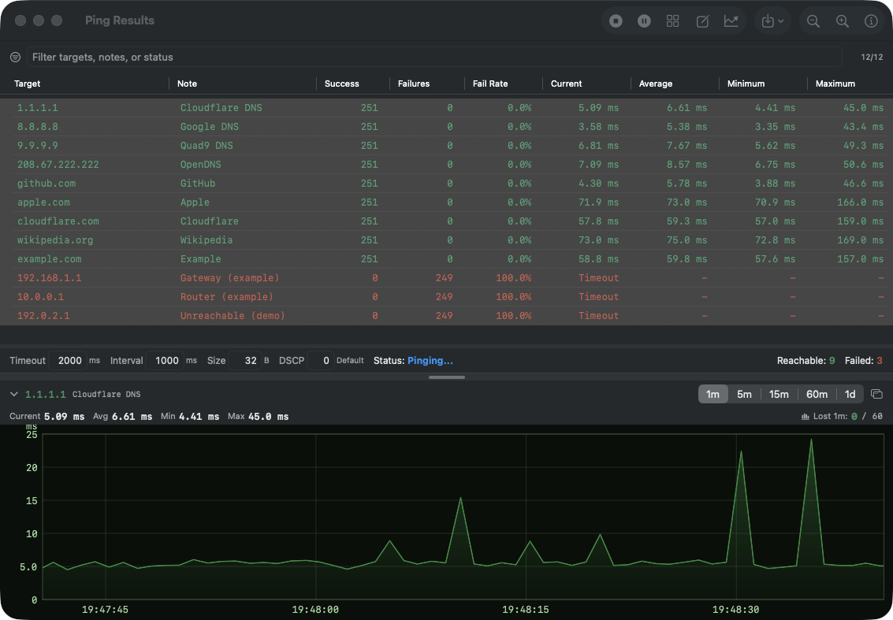
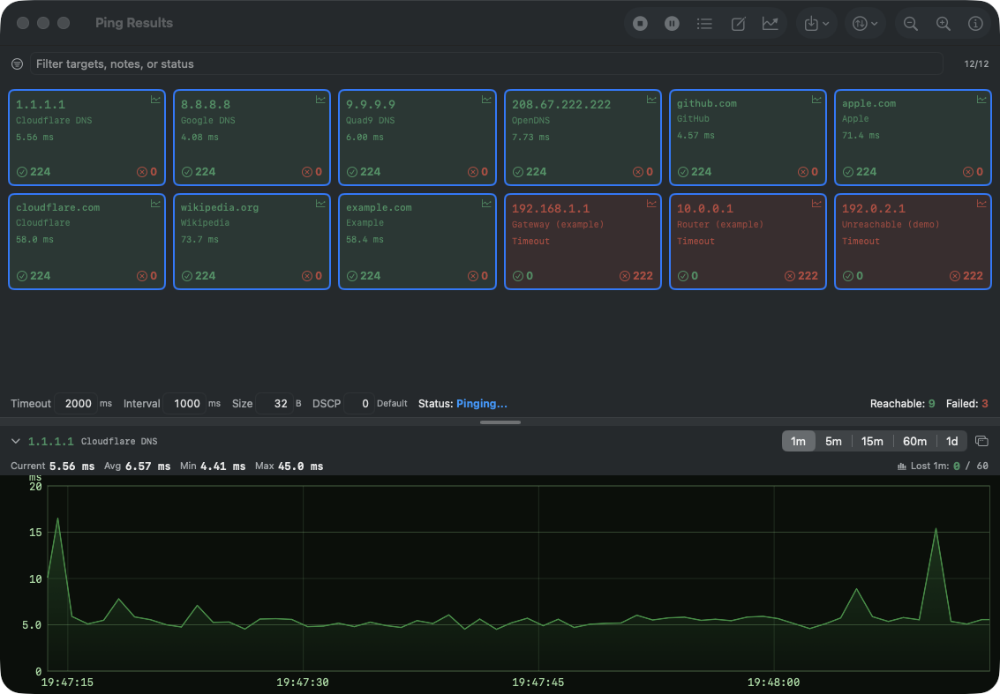
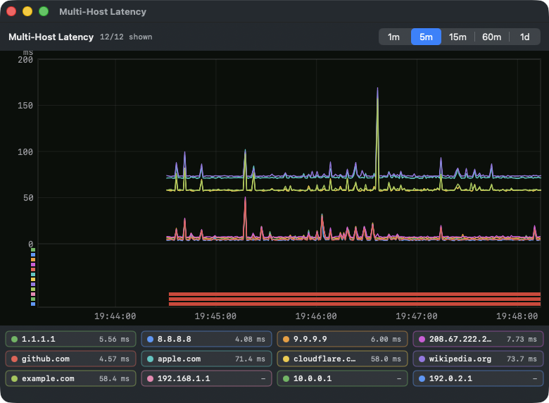
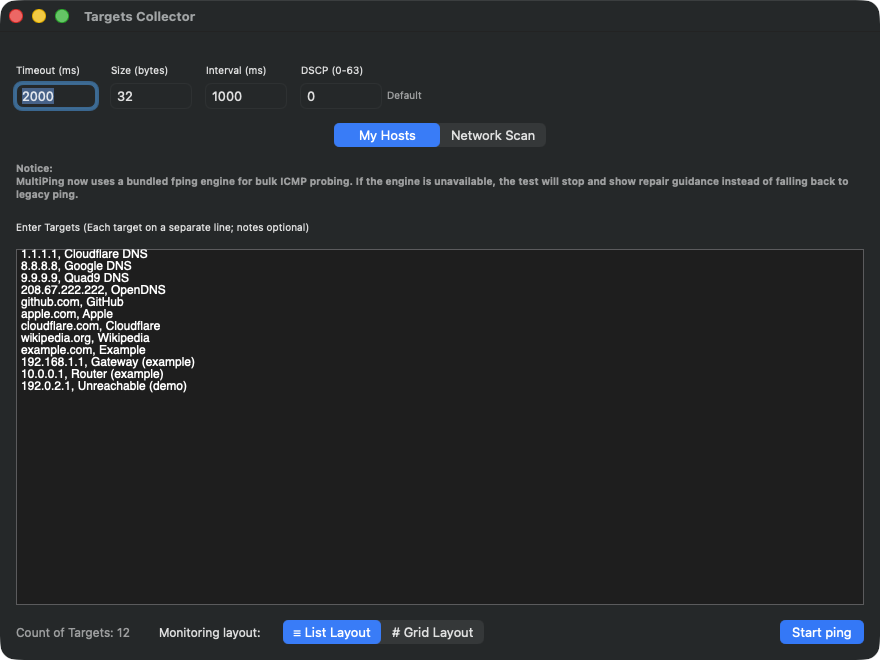
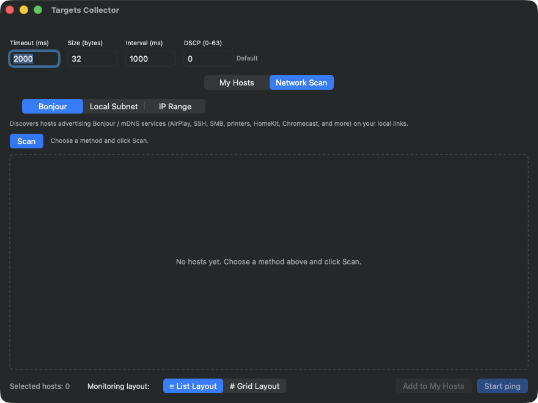

# MultiPing for macOS

MultiPing is a lightweight macOS network monitoring utility for pinging many targets at once. It is designed for network engineers, IT administrators, and power users who need a fast visual overview of host reachability, packet loss, and latency across IPv4, IPv6, and domain-name targets.



> **This is a fork, at v2.0**, of
> [u5f2094ee/MultiPing-for-macOS](https://github.com/u5f2094ee/MultiPing-for-macOS).
> It adds latency-over-time graphs, a network scanner with MAC/vendor
> identification, a menu-bar summary, per-host tools, and Developer ID signing
> with Apple notarization so release builds launch without a Gatekeeper prompt.
> Release builds are universal — Apple Silicon and Intel.
>
> **[Download the latest release →](https://github.com/gargamel778/MultiPing-for-macOS/releases/latest)**

---

## Highlights

- **Bulk ICMP probing** with a bundled `fping` engine.
- **IPv4, IPv6, and domain-name targets** can be monitored in the same session.
- **Per-target notes** make large target lists easier to read and export.
- **List and Grid layouts** can be switched while monitoring is still running.
- **Live filtering** by target, note, status, or target type.
- **Latency statistics** for current, average, minimum, and maximum response time.
- **DSCP marking** support for QoS testing.
- **Export results** to CSV, HTML, or Excel-compatible `.xls` files.

Added by this fork:

- **Latency-over-time graphs** — per target, embedded in the list, or overlaid for several hosts at once.
- **Network scan** — discovery by Bonjour, local subnet or an explicit IP range, with **MAC address and vendor (OUI)** identification and reverse-DNS host naming. Add everything found, or just a selection, to **My Hosts** — which persists across launches. Sweep results are completed from the ARP cache, because a fast `fping` sweep loses a substantial share of replies on its own.
- **Menu-bar summary** with its own sort order, a hover list of failing hosts, and a one-minute latency graph per host.
- **Per-host tools** — HTTP/HTTPS/SSH launchers and a port scanner.
- **Live-editable probe settings**, changeable without stopping the session.

---

## What it looks like

**Grid layout** — one card per target, sized to the window, colour-coded by state.



**Multi-host latency** — overlay any selection of targets on one axis. Legend
chips toggle a series; the bars beneath the plot are per-host loss lanes, so a
target that stops replying leaves a visible trace instead of just vanishing from
the line.



**Targets Collector** — paste or type targets, one per line, with optional notes
after a comma. IPv4, IPv6 and domain names can be mixed freely in one session.



**Network Scan** — discover what is actually on the network by Bonjour, by local
subnet, or across an explicit IP range. Everything found is ticked by default,
so you deselect what you don't want rather than picking hosts one at a time;
**Select all** and **Select none** flip the whole list. The chosen hosts can go
straight into a ping session, or be added to **My Hosts** to keep.



*(The screenshots use public DNS resolvers and RFC 5737 documentation addresses;
the three failing rows are deliberate, to show how unreachable targets render.)*

---

## Features

### Target input

Enter one target per line. Notes are optional and can be separated from the target by a comma, tab, or space.

```text
10.0.0.1
8.8.8.8 public-dns
2001:db8::1, lab-ipv6-gateway
example.com web-test
```

Supported target types:

- IPv4 addresses
- IPv6 addresses
- Domain names

This list is **My Hosts**, and it persists across launches — it is saved
whenever it changes and restored at startup, so repeated checks can be restarted
immediately and a list built up over time is not lost on quit. Hosts found by a
[Network Scan](#network-scan) can be appended to it directly.

### Probe settings

The target collector supports:

- **Timeout** in milliseconds
- **Packet size** in bytes
- **Interval** in seconds
- **DSCP** value from `0` to `63`

The app validates the settings before each run. The interval is automatically adjusted so it remains longer than the timeout window. DSCP values are shown with common labels where applicable, including `CS1`, `CS3`, `AF41`, `EF`, and `CS7`.

### Monitoring layouts

MultiPing provides two result views:

#### List Layout

The List Layout uses a native macOS table and is best for detailed monitoring and troubleshooting.

Available columns include:

- Target
- Note
- Success count
- Failure count
- Failure rate
- Current latency
- Average latency
- Minimum latency
- Maximum latency

Columns can be resized and reordered, and the column order is persisted between runs.

#### Grid Layout

The Grid Layout is optimized for high-density visual monitoring. Each card shows the target, optional note, latest status or response time, success count, and failure count.

Grid results can be sorted by:

- Target
- Success count
- Failure count

### Filtering, sorting, and zooming

Both layouts include a live filter bar. Filtering matches target values, notes, status text, and target type.

The result views also support:

- Sorting by key result fields
- IPv4-aware target sorting
- Zoom in and zoom out for dense screens
- Reachable and failed counters in the status bar

### Session controls

During a monitoring session you can:

- Start pinging
- Pause
- Resume
- Stop and clear results
- Switch between List and Grid layouts
- Export the currently displayed results

### Export

Results can be exported from either layout as:

- **Excel-compatible `.xls`**
- **CSV**
- **HTML**

Exported fields include target, type, note, current latency, average latency, minimum latency, maximum latency, success count, failure count, failure rate, and status.

---

## Added by this fork

### Latency graphs

Every target keeps a rolling latency history, viewable over **1m / 5m / 15m /
60m / 1d**. Three presentations share one engine:

- **Embedded** — a graph pinned under the results list for the selected target, with current/avg/min/max and the loss count for the window.
- **Single-host window** — a detached window per target, so several can be watched side by side.
- **Multi-host overlay** — any selection on one axis, with per-host loss lanes beneath the plot.

Gaps are drawn as gaps. When the probe interval changes mid-session the spacing
changes with it, rather than the line silently interpolating across a period
when nothing was measured.

### Network scan

Discovery by three methods, which can be combined:

- **Bonjour / mDNS** — anything advertising AirPlay, SSH, SMB, printing, HomeKit, Chromecast and similar.
- **Local subnet** — computed from the host's own address and mask, with a host count shown before you commit.
- **IP range** — an explicit first and last address.

Results carry the **MAC address** and the **vendor** derived from it, plus a
reverse-DNS name where one exists.

Every discovered host starts **selected**, on the assumption that after running
a scan you usually want most of what it found — so the work is deselecting the
few you don't want, not ticking the many you do. **Select all** and **Select
none** flip the entire list at once, and clicking a row toggles it.

**Add to My Hosts** appends the selection to your saved target list, carrying
the reverse-DNS name across as the note. It **skips anything already there**, so
re-scanning the same network and adding again grows the list rather than
duplicating it; if nothing is new it says so instead of appearing to do nothing.
Hosts can equally be sent straight into a ping session without being saved.

**My Hosts persists across launches.** It is written every time it changes and
restored at startup, so the list you build up — by hand, by scanning, or both —
is still there next time you open the app.

Sweep results are completed from the ARP cache. This matters more than it
sounds: a fast `fping` sweep loses a substantial share of replies to its own
burst rate, and on the network this was developed against that left roughly 40%
of live hosts undiscovered. Consulting the ARP table afterwards recovers them.

### Menu-bar summary

An optional status-item view showing targets at a glance without the main
window: a configurable number of rows, **its own sort order** independent of the
main window, a hover list of currently-failing hosts, and a one-minute latency
graph per host on hover.

### Per-host tools

Right-click any target for HTTP / HTTPS / SSH launchers and a **port scanner**.

### Live-editable probe settings

Timeout, interval, packet size and DSCP can be changed while a session is
running, without stopping and restarting it.

---

## Building a signed, notarized release

`Tools/sign-and-notarize.sh` performs the whole pipeline: builds Release as a
universal binary, signs nested helpers inside-out, submits to Apple, staples the
ticket, verifies with `spctl`, then installs to `/Applications` — verifying the
copy by checksum and rolling back to the previous version if either that or the
Gatekeeper check fails.

It needs two things of your own, neither of which lives in this repository:

1. A **Developer ID Application** certificate — Xcode ▸ Settings ▸ Accounts ▸ Manage Certificates ▸ **+**. Note that `xcodebuild -allowProvisioningUpdates` cannot create one; it only handles development and App Store certificates.
2. **Notarization credentials** in your keychain:

   ```
   xcrun notarytool store-credentials "MultiPing-Notary" \
     --apple-id "you@example.com" --team-id "YOURTEAMID"
   ```

Then copy `Tools/signing.env.example` to `Tools/signing.env` (gitignored) and
fill in your team ID, Apple ID and profile name:

```
./Tools/sign-and-notarize.sh
```

---

## Engine and reliability

MultiPing uses a bundled `fping` helper for bulk ICMP probing. IPv4/domain targets and IPv6 targets are processed in separate `fping` batches, improving efficiency for larger target sets.

The app intentionally does not silently fall back to the legacy system `ping` command. If the bundled engine is missing, not executable, or returns a fatal error, MultiPing stops the test and displays repair guidance instead of showing misleading results.

Additional reliability behavior:

- Automatic retry when the `fping` process times out
- Clear engine-unavailable status when probing cannot continue
- Safer shutdown when closing result windows or quitting the app
- Historical latency statistics are preserved across temporary failures during a session

---

## How to run from source

1. Clone or download this repository.
2. Open `MultiPing.xcodeproj` in Xcode.
3. Select the **MultiPing for macOS** target.
4. Build and run the app.
5. Enter targets, choose a layout, and click **Start ping**.

The current project targets **macOS 13.5 or later**. Because the project file uses modern Xcode project structure, **Xcode 16 or later is recommended** for opening and building the current source tree.

---

## Release app notes

Builds produced by `Tools/sign-and-notarize.sh` are signed with a Developer ID
certificate and notarized by Apple, with the ticket stapled, so they launch
without any Gatekeeper prompt and validate offline. If you build the app
yourself in Xcode without that certificate, the result is ad-hoc signed and
macOS *will* block it — in that case open **System Settings → Privacy &
Security** and choose **Open Anyway**.

Do not remove the bundled `fping` file from the app package. MultiPing depends on it for ICMP probing.

---

## Requirements

- macOS 13.5 or later
- Apple Silicon or Intel Mac — release builds are universal (`arm64` + `x86_64`)
- Bundled `fping` helper included in the app resources

---

## Third-party components

**fping** — bundled for ICMP probing. This product includes software developed
by Stanford University, by Roland Schemers, Jeremy Cheng, Rick Rodgers, Scott
Trihus and David Papp. Licence text ships in the app bundle and in the source
tree as `fping_LICENSE.txt`.

**MAC vendor data** — `MultiPing/oui.txt` is generated from the IEEE
Registration Authority's public registries (MA-L, MA-M, MA-S, IAB and CID) by
`Tools/refresh-oui.sh` in the companion MultiPing-iOS repository. It is not
derived from any redistribution of that data. See
[DATA-PROVENANCE.md](DATA-PROVENANCE.md) for the sources and why they may be
redistributed.

**Upstream project** — this fork is derived from
[u5f2094ee/MultiPing-for-macOS](https://github.com/u5f2094ee/MultiPing-for-macOS),
© 2025 u5f2094ee, MIT License. The notice ships in the app bundle as
`MultiPing_LICENSE.txt` and in the source tree as [LICENSE](LICENSE).

---

## Acknowledgements

Special thanks to Gemini, Codex, GPT-o3, and GPT-o4-mini-high for their support and contributions during the development of this project.
